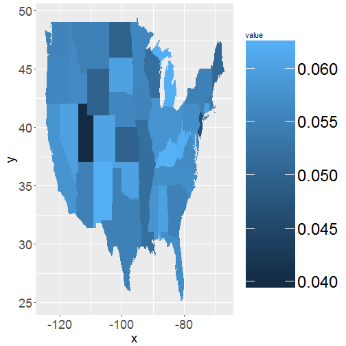

<style>
.reveal h3 {
  padding-bottom: 25px;
}

</style>

Untappd 2.0
========================================================
author: Cho Kim, Jonathan Marin, and Nicole Wittlin
date: 2/28/2018
autosize: true

SMU MSDS 6306 - Case Study #1


Introduction: Client
========================================================


***

Business Challenge:<br>
Two New Business Units
- Community Engagement
- Beer Tourism


Data Overview
========================================================
- Origin of Data Sets
- Beer Data: 2410 observations, 7 variables, including Name, Style, Alcohol By Volume (ABV), International Bittering Units scale (IBU), and serving size (in oz)
- Brewery Data: 558 observations, 4 variables, including Name, City, and State
- Exploratory Analysis:
  - Missing Information
  - Duplicate Data

Data Overview
=========================================================

```r
#setwd("C:/Users/Marin Family/Desktop/Doing Data Science/Case Study1 Git")

library(sqldf)
library(magrittr)
library(kableExtra)
library(ggplot2)
library(maps)
library(stringdist)

#Read the data
Beers <- read.csv("Beers.csv", encoding='UTF-8')
Brews <- read.csv("Breweries.csv", encoding='UTF-8', sep=",")
```

Duplicate Data Analysis
========================================================
<table class="table table-striped" style="font-size: 12px; width: auto !important; margin-left: auto; margin-right: auto;">
 <thead>
  <tr>
   <th style="text-align:right;"> Brew_ID </th>
   <th style="text-align:right;"> Brew_ID </th>
   <th style="text-align:left;"> Name </th>
   <th style="text-align:left;"> Name </th>
   <th style="text-align:left;"> City </th>
   <th style="text-align:left;"> City </th>
   <th style="text-align:left;"> State </th>
   <th style="text-align:left;"> State </th>
  </tr>
 </thead>
<tbody>
  <tr>
   <td style="text-align:right;"> 13 </td>
   <td style="text-align:right;"> 96 </td>
   <td style="text-align:left;"> Blackrocks Brewery </td>
   <td style="text-align:left;"> Blackrocks Brewery </td>
   <td style="text-align:left;"> Marquette </td>
   <td style="text-align:left;"> Marquette </td>
   <td style="text-align:left;"> MI </td>
   <td style="text-align:left;"> MA </td>
  </tr>
  <tr>
   <td style="text-align:right;"> 59 </td>
   <td style="text-align:right;"> 139 </td>
   <td style="text-align:left;"> Summit Brewing Company </td>
   <td style="text-align:left;"> Summit Brewing Company </td>
   <td style="text-align:left;"> St. Paul </td>
   <td style="text-align:left;"> St Paul </td>
   <td style="text-align:left;"> MN </td>
   <td style="text-align:left;"> MN </td>
  </tr>
  <tr>
   <td style="text-align:right;"> 96 </td>
   <td style="text-align:right;"> 13 </td>
   <td style="text-align:left;"> Blackrocks Brewery </td>
   <td style="text-align:left;"> Blackrocks Brewery </td>
   <td style="text-align:left;"> Marquette </td>
   <td style="text-align:left;"> Marquette </td>
   <td style="text-align:left;"> MA </td>
   <td style="text-align:left;"> MI </td>
  </tr>
  <tr>
   <td style="text-align:right;"> 139 </td>
   <td style="text-align:right;"> 59 </td>
   <td style="text-align:left;"> Summit Brewing Company </td>
   <td style="text-align:left;"> Summit Brewing Company </td>
   <td style="text-align:left;"> St Paul </td>
   <td style="text-align:left;"> St. Paul </td>
   <td style="text-align:left;"> MN </td>
   <td style="text-align:left;"> MN </td>
  </tr>
  <tr>
   <td style="text-align:right;"> 164 </td>
   <td style="text-align:right;"> 372 </td>
   <td style="text-align:left;"> Sly Fox Brewing Company </td>
   <td style="text-align:left;"> Sly Fox Brewing Company </td>
   <td style="text-align:left;"> Phoenixville </td>
   <td style="text-align:left;"> Pottstown </td>
   <td style="text-align:left;"> PA </td>
   <td style="text-align:left;"> PA </td>
  </tr>
  <tr>
   <td style="text-align:right;"> 167 </td>
   <td style="text-align:right;"> 504 </td>
   <td style="text-align:left;"> Oskar Blues Brewery </td>
   <td style="text-align:left;"> Oskar Blues Brewery </td>
   <td style="text-align:left;"> Longmont </td>
   <td style="text-align:left;"> Lyons </td>
   <td style="text-align:left;"> CO </td>
   <td style="text-align:left;"> CO </td>
  </tr>
  <tr>
   <td style="text-align:right;"> 262 </td>
   <td style="text-align:right;"> 276 </td>
   <td style="text-align:left;"> Otter Creek Brewing </td>
   <td style="text-align:left;"> Otter Creek Brewing </td>
   <td style="text-align:left;"> Waterbury </td>
   <td style="text-align:left;"> Middlebury </td>
   <td style="text-align:left;"> VT </td>
   <td style="text-align:left;"> VT </td>
  </tr>
  <tr>
   <td style="text-align:right;"> 276 </td>
   <td style="text-align:right;"> 262 </td>
   <td style="text-align:left;"> Otter Creek Brewing </td>
   <td style="text-align:left;"> Otter Creek Brewing </td>
   <td style="text-align:left;"> Middlebury </td>
   <td style="text-align:left;"> Waterbury </td>
   <td style="text-align:left;"> VT </td>
   <td style="text-align:left;"> VT </td>
  </tr>
  <tr>
   <td style="text-align:right;"> 372 </td>
   <td style="text-align:right;"> 164 </td>
   <td style="text-align:left;"> Sly Fox Brewing Company </td>
   <td style="text-align:left;"> Sly Fox Brewing Company </td>
   <td style="text-align:left;"> Pottstown </td>
   <td style="text-align:left;"> Phoenixville </td>
   <td style="text-align:left;"> PA </td>
   <td style="text-align:left;"> PA </td>
  </tr>
  <tr>
   <td style="text-align:right;"> 378 </td>
   <td style="text-align:right;"> 457 </td>
   <td style="text-align:left;"> Lucette Brewing Company </td>
   <td style="text-align:left;"> Lucette Brewing Company </td>
   <td style="text-align:left;"> Menominee </td>
   <td style="text-align:left;"> Menominie </td>
   <td style="text-align:left;"> WI </td>
   <td style="text-align:left;"> WI </td>
  </tr>
  <tr>
   <td style="text-align:right;"> 383 </td>
   <td style="text-align:right;"> 415 </td>
   <td style="text-align:left;"> Blue Mountain Brewery </td>
   <td style="text-align:left;"> Blue Mountain Brewery </td>
   <td style="text-align:left;"> Afton </td>
   <td style="text-align:left;"> Arrington </td>
   <td style="text-align:left;"> VA </td>
   <td style="text-align:left;"> VA </td>
  </tr>
  <tr>
   <td style="text-align:right;"> 415 </td>
   <td style="text-align:right;"> 383 </td>
   <td style="text-align:left;"> Blue Mountain Brewery </td>
   <td style="text-align:left;"> Blue Mountain Brewery </td>
   <td style="text-align:left;"> Arrington </td>
   <td style="text-align:left;"> Afton </td>
   <td style="text-align:left;"> VA </td>
   <td style="text-align:left;"> VA </td>
  </tr>
  <tr>
   <td style="text-align:right;"> 457 </td>
   <td style="text-align:right;"> 378 </td>
   <td style="text-align:left;"> Lucette Brewing Company </td>
   <td style="text-align:left;"> Lucette Brewing Company </td>
   <td style="text-align:left;"> Menominie </td>
   <td style="text-align:left;"> Menominee </td>
   <td style="text-align:left;"> WI </td>
   <td style="text-align:left;"> WI </td>
  </tr>
  <tr>
   <td style="text-align:right;"> 504 </td>
   <td style="text-align:right;"> 167 </td>
   <td style="text-align:left;"> Oskar Blues Brewery </td>
   <td style="text-align:left;"> Oskar Blues Brewery </td>
   <td style="text-align:left;"> Lyons </td>
   <td style="text-align:left;"> Longmont </td>
   <td style="text-align:left;"> CO </td>
   <td style="text-align:left;"> CO </td>
  </tr>
</tbody>
</table>


Duplicate Data Resolution
========================================================

<table class="table table-striped" style="font-size: 12px; width: auto !important; margin-left: auto; margin-right: auto;">
 <thead>
  <tr>
   <th style="text-align:right;"> Brew_ID </th>
   <th style="text-align:right;"> Brew_ID </th>
   <th style="text-align:left;"> String1 </th>
   <th style="text-align:left;"> String2 </th>
   <th style="text-align:right;"> LDistance </th>
  </tr>
 </thead>
<tbody>
  <tr>
   <td style="text-align:right;"> 13 </td>
   <td style="text-align:right;"> 96 </td>
   <td style="text-align:left;"> Blackrocks BreweryMarquette MI </td>
   <td style="text-align:left;"> Blackrocks BreweryMarquette MA </td>
   <td style="text-align:right;"> 1 </td>
  </tr>
  <tr>
   <td style="text-align:right;"> 59 </td>
   <td style="text-align:right;"> 139 </td>
   <td style="text-align:left;"> Summit Brewing CompanySt. Paul MN </td>
   <td style="text-align:left;"> Summit Brewing CompanySt Paul MN </td>
   <td style="text-align:right;"> 1 </td>
  </tr>
  <tr>
   <td style="text-align:right;"> 96 </td>
   <td style="text-align:right;"> 13 </td>
   <td style="text-align:left;"> Blackrocks BreweryMarquette MA </td>
   <td style="text-align:left;"> Blackrocks BreweryMarquette MI </td>
   <td style="text-align:right;"> 1 </td>
  </tr>
  <tr>
   <td style="text-align:right;"> 139 </td>
   <td style="text-align:right;"> 59 </td>
   <td style="text-align:left;"> Summit Brewing CompanySt Paul MN </td>
   <td style="text-align:left;"> Summit Brewing CompanySt. Paul MN </td>
   <td style="text-align:right;"> 1 </td>
  </tr>
  <tr>
   <td style="text-align:right;"> 164 </td>
   <td style="text-align:right;"> 372 </td>
   <td style="text-align:left;"> Sly Fox Brewing CompanyPhoenixville PA </td>
   <td style="text-align:left;"> Sly Fox Brewing CompanyPottstown PA </td>
   <td style="text-align:right;"> 10 </td>
  </tr>
  <tr>
   <td style="text-align:right;"> 167 </td>
   <td style="text-align:right;"> 504 </td>
   <td style="text-align:left;"> Oskar Blues BreweryLongmont CO </td>
   <td style="text-align:left;"> Oskar Blues BreweryLyons CO </td>
   <td style="text-align:right;"> 5 </td>
  </tr>
  <tr>
   <td style="text-align:right;"> 262 </td>
   <td style="text-align:right;"> 276 </td>
   <td style="text-align:left;"> Otter Creek BrewingWaterbury VT </td>
   <td style="text-align:left;"> Otter Creek BrewingMiddlebury VT </td>
   <td style="text-align:right;"> 6 </td>
  </tr>
  <tr>
   <td style="text-align:right;"> 276 </td>
   <td style="text-align:right;"> 262 </td>
   <td style="text-align:left;"> Otter Creek BrewingMiddlebury VT </td>
   <td style="text-align:left;"> Otter Creek BrewingWaterbury VT </td>
   <td style="text-align:right;"> 6 </td>
  </tr>
  <tr>
   <td style="text-align:right;"> 372 </td>
   <td style="text-align:right;"> 164 </td>
   <td style="text-align:left;"> Sly Fox Brewing CompanyPottstown PA </td>
   <td style="text-align:left;"> Sly Fox Brewing CompanyPhoenixville PA </td>
   <td style="text-align:right;"> 10 </td>
  </tr>
  <tr>
   <td style="text-align:right;"> 378 </td>
   <td style="text-align:right;"> 457 </td>
   <td style="text-align:left;"> Lucette Brewing CompanyMenominee WI </td>
   <td style="text-align:left;"> Lucette Brewing CompanyMenominie WI </td>
   <td style="text-align:right;"> 1 </td>
  </tr>
  <tr>
   <td style="text-align:right;"> 383 </td>
   <td style="text-align:right;"> 415 </td>
   <td style="text-align:left;"> Blue Mountain BreweryAfton VA </td>
   <td style="text-align:left;"> Blue Mountain BreweryArrington VA </td>
   <td style="text-align:right;"> 5 </td>
  </tr>
  <tr>
   <td style="text-align:right;"> 415 </td>
   <td style="text-align:right;"> 383 </td>
   <td style="text-align:left;"> Blue Mountain BreweryArrington VA </td>
   <td style="text-align:left;"> Blue Mountain BreweryAfton VA </td>
   <td style="text-align:right;"> 5 </td>
  </tr>
  <tr>
   <td style="text-align:right;"> 457 </td>
   <td style="text-align:right;"> 378 </td>
   <td style="text-align:left;"> Lucette Brewing CompanyMenominie WI </td>
   <td style="text-align:left;"> Lucette Brewing CompanyMenominee WI </td>
   <td style="text-align:right;"> 1 </td>
  </tr>
  <tr>
   <td style="text-align:right;"> 504 </td>
   <td style="text-align:right;"> 167 </td>
   <td style="text-align:left;"> Oskar Blues BreweryLyons CO </td>
   <td style="text-align:left;"> Oskar Blues BreweryLongmont CO </td>
   <td style="text-align:right;"> 5 </td>
  </tr>
</tbody>
</table>

Number of NAs:
========================================================
<table class="table table-striped" style="font-size: 14px; width: auto !important; margin-left: auto; margin-right: auto;">
 <thead>
  <tr>
   <th style="text-align:left;"> ColumnName </th>
   <th style="text-align:left;"> NumberOfNAs </th>
  </tr>
 </thead>
<tbody>
  <tr>
   <td style="text-align:left;"> Brew_ID </td>
   <td style="text-align:left;"> 0 </td>
  </tr>
  <tr>
   <td style="text-align:left;"> BrewName </td>
   <td style="text-align:left;"> 0 </td>
  </tr>
  <tr>
   <td style="text-align:left;"> City </td>
   <td style="text-align:left;"> 0 </td>
  </tr>
  <tr>
   <td style="text-align:left;"> State </td>
   <td style="text-align:left;"> 0 </td>
  </tr>
  <tr>
   <td style="text-align:left;"> BeerName </td>
   <td style="text-align:left;"> 0 </td>
  </tr>
  <tr>
   <td style="text-align:left;"> ABV </td>
   <td style="text-align:left;"> 62 </td>
  </tr>
  <tr>
   <td style="text-align:left;"> IBU </td>
   <td style="text-align:left;"> 1005 </td>
  </tr>
  <tr>
   <td style="text-align:left;"> Style </td>
   <td style="text-align:left;"> 0 </td>
  </tr>
  <tr>
   <td style="text-align:left;"> Ounces </td>
   <td style="text-align:left;"> 0 </td>
  </tr>
</tbody>
</table>


Data Snapshot: First 6 Observations
========================================================
<table class="table table-striped" style="font-size: 14px; width: auto !important; margin-left: auto; margin-right: auto;">
 <thead>
  <tr>
   <th style="text-align:left;"> Brew_ID </th>
   <th style="text-align:left;"> BrewName </th>
   <th style="text-align:left;"> City </th>
   <th style="text-align:left;"> State </th>
   <th style="text-align:left;"> BeerName </th>
   <th style="text-align:right;"> ABV </th>
   <th style="text-align:right;"> IBU </th>
   <th style="text-align:left;"> Style </th>
   <th style="text-align:right;"> Ounces </th>
  </tr>
 </thead>
<tbody>
  <tr>
   <td style="text-align:left;"> 1 </td>
   <td style="text-align:left;"> NorthGate Brewing </td>
   <td style="text-align:left;"> Minneapolis </td>
   <td style="text-align:left;"> MN </td>
   <td style="text-align:left;"> Get Together </td>
   <td style="text-align:right;"> 0.045 </td>
   <td style="text-align:right;"> 50 </td>
   <td style="text-align:left;"> American IPA </td>
   <td style="text-align:right;"> 16 </td>
  </tr>
  <tr>
   <td style="text-align:left;"> 1 </td>
   <td style="text-align:left;"> NorthGate Brewing </td>
   <td style="text-align:left;"> Minneapolis </td>
   <td style="text-align:left;"> MN </td>
   <td style="text-align:left;"> Maggie's Leap </td>
   <td style="text-align:right;"> 0.049 </td>
   <td style="text-align:right;"> 26 </td>
   <td style="text-align:left;"> Milk / Sweet Stout </td>
   <td style="text-align:right;"> 16 </td>
  </tr>
  <tr>
   <td style="text-align:left;"> 1 </td>
   <td style="text-align:left;"> NorthGate Brewing </td>
   <td style="text-align:left;"> Minneapolis </td>
   <td style="text-align:left;"> MN </td>
   <td style="text-align:left;"> Parapet ESB </td>
   <td style="text-align:right;"> 0.056 </td>
   <td style="text-align:right;"> 47 </td>
   <td style="text-align:left;"> Extra Special / Strong Bitter (ESB) </td>
   <td style="text-align:right;"> 16 </td>
  </tr>
  <tr>
   <td style="text-align:left;"> 1 </td>
   <td style="text-align:left;"> NorthGate Brewing </td>
   <td style="text-align:left;"> Minneapolis </td>
   <td style="text-align:left;"> MN </td>
   <td style="text-align:left;"> Pumpion </td>
   <td style="text-align:right;"> 0.060 </td>
   <td style="text-align:right;"> 38 </td>
   <td style="text-align:left;"> Pumpkin Ale </td>
   <td style="text-align:right;"> 16 </td>
  </tr>
  <tr>
   <td style="text-align:left;"> 1 </td>
   <td style="text-align:left;"> NorthGate Brewing </td>
   <td style="text-align:left;"> Minneapolis </td>
   <td style="text-align:left;"> MN </td>
   <td style="text-align:left;"> Stronghold </td>
   <td style="text-align:right;"> 0.060 </td>
   <td style="text-align:right;"> 25 </td>
   <td style="text-align:left;"> American Porter </td>
   <td style="text-align:right;"> 16 </td>
  </tr>
  <tr>
   <td style="text-align:left;"> 1 </td>
   <td style="text-align:left;"> NorthGate Brewing </td>
   <td style="text-align:left;"> Minneapolis </td>
   <td style="text-align:left;"> MN </td>
   <td style="text-align:left;"> Wall's End </td>
   <td style="text-align:right;"> 0.048 </td>
   <td style="text-align:right;"> 19 </td>
   <td style="text-align:left;"> English Brown Ale </td>
   <td style="text-align:right;"> 16 </td>
  </tr>
</tbody>
</table>

Data Snapshot: Last 6 Observations
========================================================
<table class="table table-striped" style="font-size: 14px; width: auto !important; margin-left: auto; margin-right: auto;">
 <thead>
  <tr>
   <th style="text-align:left;">   </th>
   <th style="text-align:left;"> Brew_ID </th>
   <th style="text-align:left;"> BrewName </th>
   <th style="text-align:left;"> City </th>
   <th style="text-align:left;"> State </th>
   <th style="text-align:left;"> BeerName </th>
   <th style="text-align:right;"> ABV </th>
   <th style="text-align:right;"> IBU </th>
   <th style="text-align:left;"> Style </th>
   <th style="text-align:right;"> Ounces </th>
  </tr>
 </thead>
<tbody>
  <tr>
   <td style="text-align:left;"> 2405 </td>
   <td style="text-align:left;"> 556 </td>
   <td style="text-align:left;"> Ukiah Brewing Company </td>
   <td style="text-align:left;"> Ukiah </td>
   <td style="text-align:left;"> CA </td>
   <td style="text-align:left;"> Pilsner Ukiah </td>
   <td style="text-align:right;"> 0.055 </td>
   <td style="text-align:right;"> NA </td>
   <td style="text-align:left;"> German Pilsener </td>
   <td style="text-align:right;"> 12 </td>
  </tr>
  <tr>
   <td style="text-align:left;"> 2406 </td>
   <td style="text-align:left;"> 557 </td>
   <td style="text-align:left;"> Butternuts Beer and Ale </td>
   <td style="text-align:left;"> Garrattsville </td>
   <td style="text-align:left;"> NY </td>
   <td style="text-align:left;"> Heinnieweisse Weissebier </td>
   <td style="text-align:right;"> 0.049 </td>
   <td style="text-align:right;"> NA </td>
   <td style="text-align:left;"> Hefeweizen </td>
   <td style="text-align:right;"> 12 </td>
  </tr>
  <tr>
   <td style="text-align:left;"> 2407 </td>
   <td style="text-align:left;"> 557 </td>
   <td style="text-align:left;"> Butternuts Beer and Ale </td>
   <td style="text-align:left;"> Garrattsville </td>
   <td style="text-align:left;"> NY </td>
   <td style="text-align:left;"> Moo Thunder Stout </td>
   <td style="text-align:right;"> 0.049 </td>
   <td style="text-align:right;"> NA </td>
   <td style="text-align:left;"> Milk / Sweet Stout </td>
   <td style="text-align:right;"> 12 </td>
  </tr>
  <tr>
   <td style="text-align:left;"> 2408 </td>
   <td style="text-align:left;"> 557 </td>
   <td style="text-align:left;"> Butternuts Beer and Ale </td>
   <td style="text-align:left;"> Garrattsville </td>
   <td style="text-align:left;"> NY </td>
   <td style="text-align:left;"> Porkslap Pale Ale </td>
   <td style="text-align:right;"> 0.043 </td>
   <td style="text-align:right;"> NA </td>
   <td style="text-align:left;"> American Pale Ale (APA) </td>
   <td style="text-align:right;"> 12 </td>
  </tr>
  <tr>
   <td style="text-align:left;"> 2409 </td>
   <td style="text-align:left;"> 557 </td>
   <td style="text-align:left;"> Butternuts Beer and Ale </td>
   <td style="text-align:left;"> Garrattsville </td>
   <td style="text-align:left;"> NY </td>
   <td style="text-align:left;"> Snapperhead IPA </td>
   <td style="text-align:right;"> 0.068 </td>
   <td style="text-align:right;"> NA </td>
   <td style="text-align:left;"> American IPA </td>
   <td style="text-align:right;"> 12 </td>
  </tr>
  <tr>
   <td style="text-align:left;"> 2410 </td>
   <td style="text-align:left;"> 558 </td>
   <td style="text-align:left;"> Sleeping Lady Brewing Company </td>
   <td style="text-align:left;"> Anchorage </td>
   <td style="text-align:left;"> AK </td>
   <td style="text-align:left;"> Urban Wilderness Pale Ale </td>
   <td style="text-align:right;"> 0.049 </td>
   <td style="text-align:right;"> NA </td>
   <td style="text-align:left;"> English Pale Ale </td>
   <td style="text-align:right;"> 12 </td>
  </tr>
</tbody>
</table>


Summary of Findings
========================================================
Breweries per State



Summary of Findings
========================================================
Breweries per State


Summary of Findings
========================================================
Median Alcohol Content by State


Summary of Findings
========================================================
ABV Statistics

```r
summary_ABV <- (summary(Beer_Data$ABV))

summary_ABV
```

```
   Min. 1st Qu.  Median    Mean 3rd Qu.    Max.    NA's 
0.00100 0.05000 0.05600 0.05977 0.06700 0.12800      62 
```

Summary of Findings
========================================================
Median IBU by State


Summary of Findings
========================================================
State with highest ABV - Colorado
<table class="table table-striped" style="font-size: 14px; width: auto !important; margin-left: auto; margin-right: auto;">
 <thead>
  <tr>
   <th style="text-align:left;">   </th>
   <th style="text-align:left;"> Brew_ID </th>
   <th style="text-align:left;"> BrewName </th>
   <th style="text-align:left;"> City </th>
   <th style="text-align:left;"> State </th>
   <th style="text-align:left;"> BeerName </th>
   <th style="text-align:right;"> ABV </th>
   <th style="text-align:right;"> IBU </th>
   <th style="text-align:left;"> Style </th>
   <th style="text-align:right;"> Ounces </th>
   <th style="text-align:right;"> ABVinPercent </th>
  </tr>
 </thead>
<tbody>
  <tr>
   <td style="text-align:left;"> 382 </td>
   <td style="text-align:left;"> 52 </td>
   <td style="text-align:left;"> Upslope Brewing Company </td>
   <td style="text-align:left;"> Boulder </td>
   <td style="text-align:left;"> CO </td>
   <td style="text-align:left;"> Lee Hill Series Vol. 5 - Belgian Style Quadrupel Ale </td>
   <td style="text-align:right;"> 0.128 </td>
   <td style="text-align:right;"> NA </td>
   <td style="text-align:left;"> Quadrupel (Quad) </td>
   <td style="text-align:right;"> 19.2 </td>
   <td style="text-align:right;"> 12.8 </td>
  </tr>
</tbody>
</table>

State with highest IBU - Oregon
<table class="table table-striped" style="font-size: 14px; width: auto !important; margin-left: auto; margin-right: auto;">
 <thead>
  <tr>
   <th style="text-align:left;">   </th>
   <th style="text-align:left;"> Brew_ID </th>
   <th style="text-align:left;"> BrewName </th>
   <th style="text-align:left;"> City </th>
   <th style="text-align:left;"> State </th>
   <th style="text-align:left;"> BeerName </th>
   <th style="text-align:right;"> ABV </th>
   <th style="text-align:right;"> IBU </th>
   <th style="text-align:left;"> Style </th>
   <th style="text-align:right;"> Ounces </th>
   <th style="text-align:right;"> ABVinPercent </th>
  </tr>
 </thead>
<tbody>
  <tr>
   <td style="text-align:left;"> 1856 </td>
   <td style="text-align:left;"> 375 </td>
   <td style="text-align:left;"> Astoria Brewing Company </td>
   <td style="text-align:left;"> Astoria </td>
   <td style="text-align:left;"> OR </td>
   <td style="text-align:left;"> Bitter Bitch Imperial IPA </td>
   <td style="text-align:right;"> 0.082 </td>
   <td style="text-align:right;"> 138 </td>
   <td style="text-align:left;"> American Double / Imperial IPA </td>
   <td style="text-align:right;"> 12 </td>
   <td style="text-align:right;"> 8.2 </td>
  </tr>
</tbody>
</table>


Summary of Findings
========================================================
Relationship between ABV and IBU


Recommendations
========================================================

