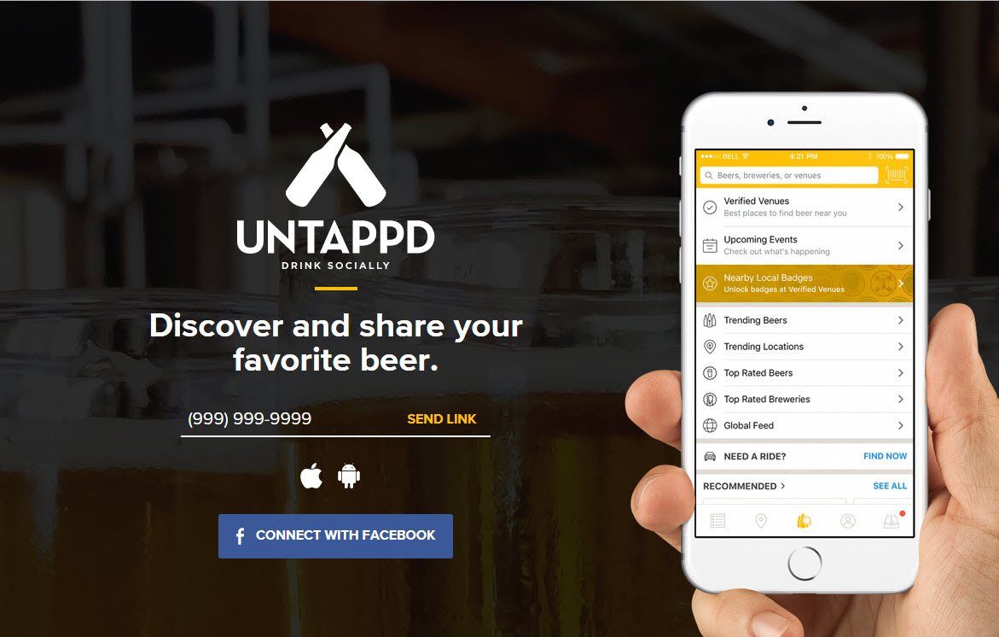

========================================================
title: Untappd 2.0
author: Cho Kim, Jonathan Marin, and Nicole Wittlin
date: 2/28/2018
autosize: true



Introduction
========================================================

Client: Uptappd

Business Challenge: Two New Business Units
- Community Engagement
- Beer Tourism


Data Overview
========================================================
- Origin of Data Sets
- Beer Data: 2410 observations, 7 variables, including Name, Style, Alcohol By Volume (ABV), International Bittering Units scale (IBU), and serving size (in oz)
- Brewery Data: 558 observations, 4 variables, including Name, City, and State
- Exploratory Analysis:
  - Missing Information
  - Duplicate Data

Data Overview
=========================================================


```
Error in file(file, "rt") : cannot open the connection
```
