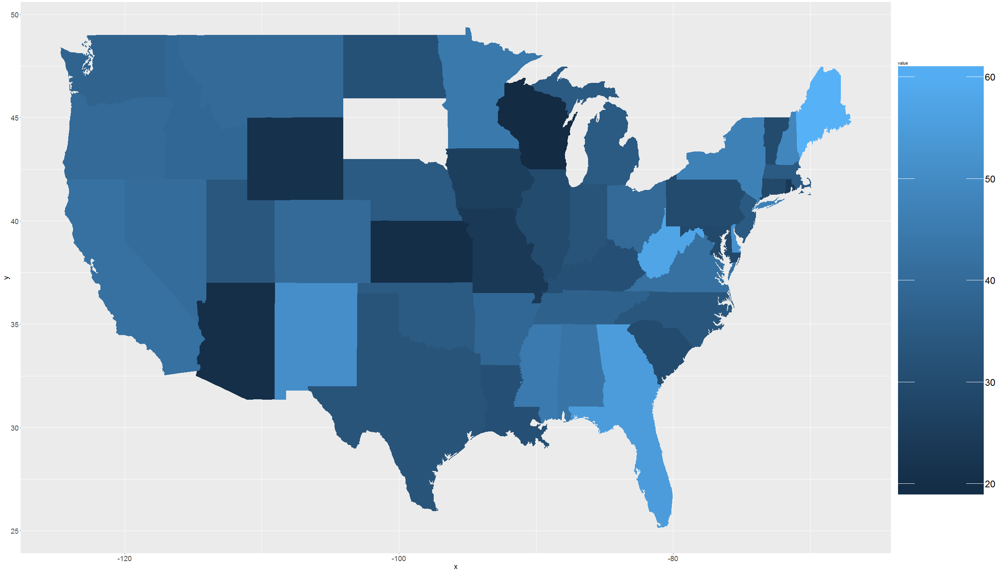

Beer Case Study
========================================================
author: Cho Kim, Nicole Wittlin, and Jonathan Marin
date: 2/20/2018
autosize: true

Introduction
========================================================
We will be examining beer data and wish to conduct an exploratory analysis to answer the following questions:
- How many Breweries are present in each state?
- Print the top and bottom 6 brew and beer data. 
- Report the Number of NA's in each column of the dataset
- Compute the median alcohol content and ibu for each state.
- Which state has the max ABV Beer? Which state has the most bitter (IBU) beer?
- Summary stats for the ABV variable
- And finally find if there is a relationship between bitterness and alcoholic content. 

Data
========================================================

Beer and Brewery data was provided by two csv files.  The brewery data lists the brewerys by state and the beer data contains the beers that breweries have to offer with that corresponding beer data. 


```r
#setwd("C:/Users/Marin Family/Desktop/Doing Data Science/Case Study1 Git")

#Read the data
Beers <- read.csv("Beers.csv", encoding='UTF-8')
Brews <- read.csv("Breweries.csv", encoding='UTF-8', sep=",")
```
How many breweries per state:
========================================================


How many breweries per state (using ggplot):
========================================================


First 6 Observations:
========================================================
<table class="table table-striped" style="font-size: 14px; width: auto !important; margin-left: auto; margin-right: auto;">
 <thead>
  <tr>
   <th style="text-align:right;"> Brew_ID </th>
   <th style="text-align:left;"> BrewName </th>
   <th style="text-align:left;"> City </th>
   <th style="text-align:left;"> State </th>
   <th style="text-align:left;"> BeerName </th>
   <th style="text-align:right;"> ABV </th>
   <th style="text-align:right;"> IBU </th>
   <th style="text-align:left;"> Style </th>
   <th style="text-align:right;"> Ounces </th>
  </tr>
 </thead>
<tbody>
  <tr>
   <td style="text-align:right;"> 1 </td>
   <td style="text-align:left;"> NorthGate Brewing </td>
   <td style="text-align:left;"> Minneapolis </td>
   <td style="text-align:left;"> MN </td>
   <td style="text-align:left;"> Get Together </td>
   <td style="text-align:right;"> 0.045 </td>
   <td style="text-align:right;"> 50 </td>
   <td style="text-align:left;"> American IPA </td>
   <td style="text-align:right;"> 16 </td>
  </tr>
  <tr>
   <td style="text-align:right;"> 1 </td>
   <td style="text-align:left;"> NorthGate Brewing </td>
   <td style="text-align:left;"> Minneapolis </td>
   <td style="text-align:left;"> MN </td>
   <td style="text-align:left;"> Maggie's Leap </td>
   <td style="text-align:right;"> 0.049 </td>
   <td style="text-align:right;"> 26 </td>
   <td style="text-align:left;"> Milk / Sweet Stout </td>
   <td style="text-align:right;"> 16 </td>
  </tr>
  <tr>
   <td style="text-align:right;"> 1 </td>
   <td style="text-align:left;"> NorthGate Brewing </td>
   <td style="text-align:left;"> Minneapolis </td>
   <td style="text-align:left;"> MN </td>
   <td style="text-align:left;"> Parapet ESB </td>
   <td style="text-align:right;"> 0.056 </td>
   <td style="text-align:right;"> 47 </td>
   <td style="text-align:left;"> Extra Special / Strong Bitter (ESB) </td>
   <td style="text-align:right;"> 16 </td>
  </tr>
  <tr>
   <td style="text-align:right;"> 1 </td>
   <td style="text-align:left;"> NorthGate Brewing </td>
   <td style="text-align:left;"> Minneapolis </td>
   <td style="text-align:left;"> MN </td>
   <td style="text-align:left;"> Pumpion </td>
   <td style="text-align:right;"> 0.060 </td>
   <td style="text-align:right;"> 38 </td>
   <td style="text-align:left;"> Pumpkin Ale </td>
   <td style="text-align:right;"> 16 </td>
  </tr>
  <tr>
   <td style="text-align:right;"> 1 </td>
   <td style="text-align:left;"> NorthGate Brewing </td>
   <td style="text-align:left;"> Minneapolis </td>
   <td style="text-align:left;"> MN </td>
   <td style="text-align:left;"> Stronghold </td>
   <td style="text-align:right;"> 0.060 </td>
   <td style="text-align:right;"> 25 </td>
   <td style="text-align:left;"> American Porter </td>
   <td style="text-align:right;"> 16 </td>
  </tr>
  <tr>
   <td style="text-align:right;"> 1 </td>
   <td style="text-align:left;"> NorthGate Brewing </td>
   <td style="text-align:left;"> Minneapolis </td>
   <td style="text-align:left;"> MN </td>
   <td style="text-align:left;"> Wall's End </td>
   <td style="text-align:right;"> 0.048 </td>
   <td style="text-align:right;"> 19 </td>
   <td style="text-align:left;"> English Brown Ale </td>
   <td style="text-align:right;"> 16 </td>
  </tr>
</tbody>
</table>

Last 6 Observations:
========================================================
<table class="table table-striped" style="font-size: 14px; width: auto !important; margin-left: auto; margin-right: auto;">
 <thead>
  <tr>
   <th style="text-align:left;">   </th>
   <th style="text-align:right;"> Brew_ID </th>
   <th style="text-align:left;"> BrewName </th>
   <th style="text-align:left;"> City </th>
   <th style="text-align:left;"> State </th>
   <th style="text-align:left;"> BeerName </th>
   <th style="text-align:right;"> ABV </th>
   <th style="text-align:right;"> IBU </th>
   <th style="text-align:left;"> Style </th>
   <th style="text-align:right;"> Ounces </th>
  </tr>
 </thead>
<tbody>
  <tr>
   <td style="text-align:left;"> 2405 </td>
   <td style="text-align:right;"> 556 </td>
   <td style="text-align:left;"> Ukiah Brewing Company </td>
   <td style="text-align:left;"> Ukiah </td>
   <td style="text-align:left;"> CA </td>
   <td style="text-align:left;"> Pilsner Ukiah </td>
   <td style="text-align:right;"> 0.055 </td>
   <td style="text-align:right;"> NA </td>
   <td style="text-align:left;"> German Pilsener </td>
   <td style="text-align:right;"> 12 </td>
  </tr>
  <tr>
   <td style="text-align:left;"> 2406 </td>
   <td style="text-align:right;"> 557 </td>
   <td style="text-align:left;"> Butternuts Beer and Ale </td>
   <td style="text-align:left;"> Garrattsville </td>
   <td style="text-align:left;"> NY </td>
   <td style="text-align:left;"> Heinnieweisse Weissebier </td>
   <td style="text-align:right;"> 0.049 </td>
   <td style="text-align:right;"> NA </td>
   <td style="text-align:left;"> Hefeweizen </td>
   <td style="text-align:right;"> 12 </td>
  </tr>
  <tr>
   <td style="text-align:left;"> 2407 </td>
   <td style="text-align:right;"> 557 </td>
   <td style="text-align:left;"> Butternuts Beer and Ale </td>
   <td style="text-align:left;"> Garrattsville </td>
   <td style="text-align:left;"> NY </td>
   <td style="text-align:left;"> Moo Thunder Stout </td>
   <td style="text-align:right;"> 0.049 </td>
   <td style="text-align:right;"> NA </td>
   <td style="text-align:left;"> Milk / Sweet Stout </td>
   <td style="text-align:right;"> 12 </td>
  </tr>
  <tr>
   <td style="text-align:left;"> 2408 </td>
   <td style="text-align:right;"> 557 </td>
   <td style="text-align:left;"> Butternuts Beer and Ale </td>
   <td style="text-align:left;"> Garrattsville </td>
   <td style="text-align:left;"> NY </td>
   <td style="text-align:left;"> Porkslap Pale Ale </td>
   <td style="text-align:right;"> 0.043 </td>
   <td style="text-align:right;"> NA </td>
   <td style="text-align:left;"> American Pale Ale (APA) </td>
   <td style="text-align:right;"> 12 </td>
  </tr>
  <tr>
   <td style="text-align:left;"> 2409 </td>
   <td style="text-align:right;"> 557 </td>
   <td style="text-align:left;"> Butternuts Beer and Ale </td>
   <td style="text-align:left;"> Garrattsville </td>
   <td style="text-align:left;"> NY </td>
   <td style="text-align:left;"> Snapperhead IPA </td>
   <td style="text-align:right;"> 0.068 </td>
   <td style="text-align:right;"> NA </td>
   <td style="text-align:left;"> American IPA </td>
   <td style="text-align:right;"> 12 </td>
  </tr>
  <tr>
   <td style="text-align:left;"> 2410 </td>
   <td style="text-align:right;"> 558 </td>
   <td style="text-align:left;"> Sleeping Lady Brewing Company </td>
   <td style="text-align:left;"> Anchorage </td>
   <td style="text-align:left;"> AK </td>
   <td style="text-align:left;"> Urban Wilderness Pale Ale </td>
   <td style="text-align:right;"> 0.049 </td>
   <td style="text-align:right;"> NA </td>
   <td style="text-align:left;"> English Pale Ale </td>
   <td style="text-align:right;"> 12 </td>
  </tr>
</tbody>
</table>


Number of NAs:
========================================================
<table class="table table-striped" style="font-size: 14px; width: auto !important; margin-left: auto; margin-right: auto;">
 <thead>
  <tr>
   <th style="text-align:left;"> ColumnName </th>
   <th style="text-align:left;"> NumberOfNAs </th>
  </tr>
 </thead>
<tbody>
  <tr>
   <td style="text-align:left;"> Brew_ID </td>
   <td style="text-align:left;"> 0 </td>
  </tr>
  <tr>
   <td style="text-align:left;"> BrewName </td>
   <td style="text-align:left;"> 0 </td>
  </tr>
  <tr>
   <td style="text-align:left;"> City </td>
   <td style="text-align:left;"> 0 </td>
  </tr>
  <tr>
   <td style="text-align:left;"> State </td>
   <td style="text-align:left;"> 0 </td>
  </tr>
  <tr>
   <td style="text-align:left;"> BeerName </td>
   <td style="text-align:left;"> 0 </td>
  </tr>
  <tr>
   <td style="text-align:left;"> ABV </td>
   <td style="text-align:left;"> 62 </td>
  </tr>
  <tr>
   <td style="text-align:left;"> IBU </td>
   <td style="text-align:left;"> 1005 </td>
  </tr>
  <tr>
   <td style="text-align:left;"> Style </td>
   <td style="text-align:left;"> 0 </td>
  </tr>
  <tr>
   <td style="text-align:left;"> Ounces </td>
   <td style="text-align:left;"> 0 </td>
  </tr>
</tbody>
</table>


Median Alcohol Content:
========================================================


Median IBU:
========================================================


Summary Stats for ABV
========================================================


```r
summary_ABV <- (summary(Beer_Data$ABV))

summary_ABV
```

```
   Min. 1st Qu.  Median    Mean 3rd Qu.    Max.    NA's 
0.00100 0.05000 0.05600 0.05977 0.06700 0.12800      62 
```

Scatter Plot
========================================================


