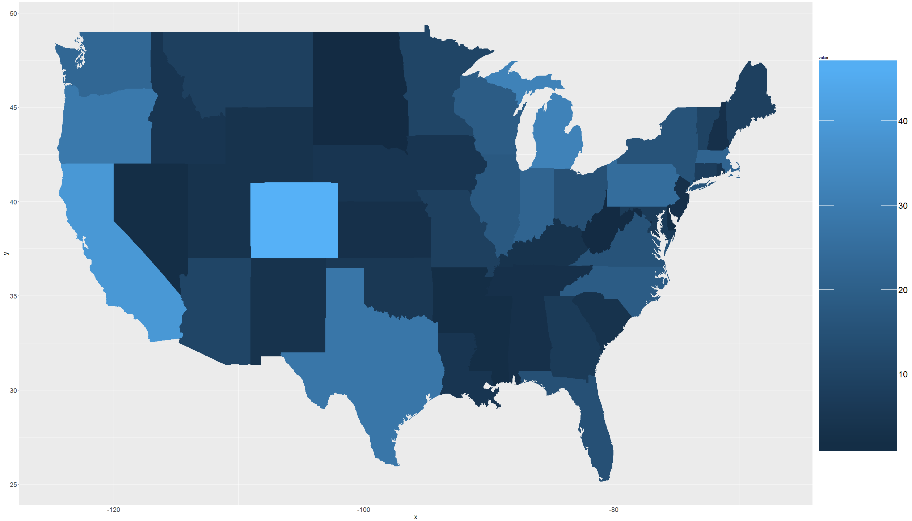

Beer Case Study
========================================================
author: Cho Kim, Nicole Wittlin, and Jonathan Marin
date: 2/20/2018
autosize: true

Introduction
========================================================
We will be examining beer data and wish to conduct an exploratory analysis to answer the following questions:
- How many Breweries are present in each state?
- Print the top and bottom 6 brew and beer data. 
- Report the Number of NA's in each column of the dataset
- Compute the median alcohol content and ibu for each state.
- Which state has the max ABV Beer? Which state has the most bitter (IBU) beer?
- Summary stats for the ABV variable
- And finally find if there is a relationship between bitterness and alcoholic content. 

Data
========================================================

Beer and Brewery data was provided by two csv files.  The brewery data lists the brewerys by state and the beer data contains the beers that breweries have to offer with that corresponding beer data. 


```r
#setwd("C:/Users/Marin Family/Desktop/Doing Data Science/Case Study1 Git")

#Read the data
Beers <- read.csv("Beers.csv", encoding='UTF-8')
Brews <- read.csv("Breweries.csv", encoding='UTF-8', sep=",")
```
How many breweries per state:
========================================================


How many breweries per state (using ggplot):
========================================================


First 6 Observations:
========================================================
<table class="table table-striped" style="font-size: 14px; width: auto !important; margin-left: auto; margin-right: auto;">
 <thead>
  <tr>
   <th style="text-align:right;"> Brew_ID </th>
   <th style="text-align:left;"> BrewName </th>
   <th style="text-align:left;"> City </th>
   <th style="text-align:left;"> State </th>
   <th style="text-align:left;"> BeerName </th>
   <th style="text-align:right;"> ABV </th>
   <th style="text-align:right;"> IBU </th>
   <th style="text-align:left;"> Style </th>
   <th style="text-align:right;"> Ounces </th>
  </tr>
 </thead>
<tbody>
  <tr>
   <td style="text-align:right;"> 1 </td>
   <td style="text-align:left;"> NorthGate Brewing </td>
   <td style="text-align:left;"> Minneapolis </td>
   <td style="text-align:left;"> MN </td>
   <td style="text-align:left;"> Get Together </td>
   <td style="text-align:right;"> 0.045 </td>
   <td style="text-align:right;"> 50 </td>
   <td style="text-align:left;"> American IPA </td>
   <td style="text-align:right;"> 16 </td>
  </tr>
  <tr>
   <td style="text-align:right;"> 1 </td>
   <td style="text-align:left;"> NorthGate Brewing </td>
   <td style="text-align:left;"> Minneapolis </td>
   <td style="text-align:left;"> MN </td>
   <td style="text-align:left;"> Maggie's Leap </td>
   <td style="text-align:right;"> 0.049 </td>
   <td style="text-align:right;"> 26 </td>
   <td style="text-align:left;"> Milk / Sweet Stout </td>
   <td style="text-align:right;"> 16 </td>
  </tr>
  <tr>
   <td style="text-align:right;"> 1 </td>
   <td style="text-align:left;"> NorthGate Brewing </td>
   <td style="text-align:left;"> Minneapolis </td>
   <td style="text-align:left;"> MN </td>
   <td style="text-align:left;"> Parapet ESB </td>
   <td style="text-align:right;"> 0.056 </td>
   <td style="text-align:right;"> 47 </td>
   <td style="text-align:left;"> Extra Special / Strong Bitter (ESB) </td>
   <td style="text-align:right;"> 16 </td>
  </tr>
  <tr>
   <td style="text-align:right;"> 1 </td>
   <td style="text-align:left;"> NorthGate Brewing </td>
   <td style="text-align:left;"> Minneapolis </td>
   <td style="text-align:left;"> MN </td>
   <td style="text-align:left;"> Pumpion </td>
   <td style="text-align:right;"> 0.060 </td>
   <td style="text-align:right;"> 38 </td>
   <td style="text-align:left;"> Pumpkin Ale </td>
   <td style="text-align:right;"> 16 </td>
  </tr>
  <tr>
   <td style="text-align:right;"> 1 </td>
   <td style="text-align:left;"> NorthGate Brewing </td>
   <td style="text-align:left;"> Minneapolis </td>
   <td style="text-align:left;"> MN </td>
   <td style="text-align:left;"> Stronghold </td>
   <td style="text-align:right;"> 0.060 </td>
   <td style="text-align:right;"> 25 </td>
   <td style="text-align:left;"> American Porter </td>
   <td style="text-align:right;"> 16 </td>
  </tr>
  <tr>
   <td style="text-align:right;"> 1 </td>
   <td style="text-align:left;"> NorthGate Brewing </td>
   <td style="text-align:left;"> Minneapolis </td>
   <td style="text-align:left;"> MN </td>
   <td style="text-align:left;"> Wall's End </td>
   <td style="text-align:right;"> 0.048 </td>
   <td style="text-align:right;"> 19 </td>
   <td style="text-align:left;"> English Brown Ale </td>
   <td style="text-align:right;"> 16 </td>
  </tr>
</tbody>
</table>

Last 6 Observations:
========================================================
<table class="table table-striped" style="font-size: 14px; width: auto !important; margin-left: auto; margin-right: auto;">
 <thead>
  <tr>
   <th style="text-align:left;">   </th>
   <th style="text-align:right;"> Brew_ID </th>
   <th style="text-align:left;"> BrewName </th>
   <th style="text-align:left;"> City </th>
   <th style="text-align:left;"> State </th>
   <th style="text-align:left;"> BeerName </th>
   <th style="text-align:right;"> ABV </th>
   <th style="text-align:right;"> IBU </th>
   <th style="text-align:left;"> Style </th>
   <th style="text-align:right;"> Ounces </th>
  </tr>
 </thead>
<tbody>
  <tr>
   <td style="text-align:left;"> 2405 </td>
   <td style="text-align:right;"> 556 </td>
   <td style="text-align:left;"> Ukiah Brewing Company </td>
   <td style="text-align:left;"> Ukiah </td>
   <td style="text-align:left;"> CA </td>
   <td style="text-align:left;"> Pilsner Ukiah </td>
   <td style="text-align:right;"> 0.055 </td>
   <td style="text-align:right;"> NA </td>
   <td style="text-align:left;"> German Pilsener </td>
   <td style="text-align:right;"> 12 </td>
  </tr>
  <tr>
   <td style="text-align:left;"> 2406 </td>
   <td style="text-align:right;"> 557 </td>
   <td style="text-align:left;"> Butternuts Beer and Ale </td>
   <td style="text-align:left;"> Garrattsville </td>
   <td style="text-align:left;"> NY </td>
   <td style="text-align:left;"> Heinnieweisse Weissebier </td>
   <td style="text-align:right;"> 0.049 </td>
   <td style="text-align:right;"> NA </td>
   <td style="text-align:left;"> Hefeweizen </td>
   <td style="text-align:right;"> 12 </td>
  </tr>
  <tr>
   <td style="text-align:left;"> 2407 </td>
   <td style="text-align:right;"> 557 </td>
   <td style="text-align:left;"> Butternuts Beer and Ale </td>
   <td style="text-align:left;"> Garrattsville </td>
   <td style="text-align:left;"> NY </td>
   <td style="text-align:left;"> Moo Thunder Stout </td>
   <td style="text-align:right;"> 0.049 </td>
   <td style="text-align:right;"> NA </td>
   <td style="text-align:left;"> Milk / Sweet Stout </td>
   <td style="text-align:right;"> 12 </td>
  </tr>
  <tr>
   <td style="text-align:left;"> 2408 </td>
   <td style="text-align:right;"> 557 </td>
   <td style="text-align:left;"> Butternuts Beer and Ale </td>
   <td style="text-align:left;"> Garrattsville </td>
   <td style="text-align:left;"> NY </td>
   <td style="text-align:left;"> Porkslap Pale Ale </td>
   <td style="text-align:right;"> 0.043 </td>
   <td style="text-align:right;"> NA </td>
   <td style="text-align:left;"> American Pale Ale (APA) </td>
   <td style="text-align:right;"> 12 </td>
  </tr>
  <tr>
   <td style="text-align:left;"> 2409 </td>
   <td style="text-align:right;"> 557 </td>
   <td style="text-align:left;"> Butternuts Beer and Ale </td>
   <td style="text-align:left;"> Garrattsville </td>
   <td style="text-align:left;"> NY </td>
   <td style="text-align:left;"> Snapperhead IPA </td>
   <td style="text-align:right;"> 0.068 </td>
   <td style="text-align:right;"> NA </td>
   <td style="text-align:left;"> American IPA </td>
   <td style="text-align:right;"> 12 </td>
  </tr>
  <tr>
   <td style="text-align:left;"> 2410 </td>
   <td style="text-align:right;"> 558 </td>
   <td style="text-align:left;"> Sleeping Lady Brewing Company </td>
   <td style="text-align:left;"> Anchorage </td>
   <td style="text-align:left;"> AK </td>
   <td style="text-align:left;"> Urban Wilderness Pale Ale </td>
   <td style="text-align:right;"> 0.049 </td>
   <td style="text-align:right;"> NA </td>
   <td style="text-align:left;"> English Pale Ale </td>
   <td style="text-align:right;"> 12 </td>
  </tr>
</tbody>
</table>


Number of NAs:
========================================================
<table class="table table-striped" style="font-size: 14px; width: auto !important; margin-left: auto; margin-right: auto;">
 <thead>
  <tr>
   <th style="text-align:left;"> ColumnName </th>
   <th style="text-align:left;"> NumberOfNAs </th>
  </tr>
 </thead>
<tbody>
  <tr>
   <td style="text-align:left;"> Brew_ID </td>
   <td style="text-align:left;"> 0 </td>
  </tr>
  <tr>
   <td style="text-align:left;"> BrewName </td>
   <td style="text-align:left;"> 0 </td>
  </tr>
  <tr>
   <td style="text-align:left;"> City </td>
   <td style="text-align:left;"> 0 </td>
  </tr>
  <tr>
   <td style="text-align:left;"> State </td>
   <td style="text-align:left;"> 0 </td>
  </tr>
  <tr>
   <td style="text-align:left;"> BeerName </td>
   <td style="text-align:left;"> 0 </td>
  </tr>
  <tr>
   <td style="text-align:left;"> ABV </td>
   <td style="text-align:left;"> 62 </td>
  </tr>
  <tr>
   <td style="text-align:left;"> IBU </td>
   <td style="text-align:left;"> 1005 </td>
  </tr>
  <tr>
   <td style="text-align:left;"> Style </td>
   <td style="text-align:left;"> 0 </td>
  </tr>
  <tr>
   <td style="text-align:left;"> Ounces </td>
   <td style="text-align:left;"> 0 </td>
  </tr>
</tbody>
</table>


Median Alcohol Content:
========================================================

<table class="table table-striped" style="font-size: 14px; width: auto !important; margin-left: auto; margin-right: auto;">
 <thead>
  <tr>
   <th style="text-align:left;"> State </th>
   <th style="text-align:right;"> ABV Median </th>
   <th style="text-align:right;"> IBU Median </th>
  </tr>
 </thead>
<tbody>
  <tr>
   <td style="text-align:left;"> alaska </td>
   <td style="text-align:right;"> 0.0560 </td>
   <td style="text-align:right;"> 46.0 </td>
  </tr>
  <tr>
   <td style="text-align:left;"> alabama </td>
   <td style="text-align:right;"> 0.0600 </td>
   <td style="text-align:right;"> 43.0 </td>
  </tr>
  <tr>
   <td style="text-align:left;"> arkansas </td>
   <td style="text-align:right;"> 0.0520 </td>
   <td style="text-align:right;"> 39.0 </td>
  </tr>
  <tr>
   <td style="text-align:left;"> arizona </td>
   <td style="text-align:right;"> 0.0550 </td>
   <td style="text-align:right;"> 20.5 </td>
  </tr>
  <tr>
   <td style="text-align:left;"> california </td>
   <td style="text-align:right;"> 0.0580 </td>
   <td style="text-align:right;"> 42.0 </td>
  </tr>
  <tr>
   <td style="text-align:left;"> colorado </td>
   <td style="text-align:right;"> 0.0605 </td>
   <td style="text-align:right;"> 40.0 </td>
  </tr>
  <tr>
   <td style="text-align:left;"> connecticut </td>
   <td style="text-align:right;"> 0.0600 </td>
   <td style="text-align:right;"> 29.0 </td>
  </tr>
  <tr>
   <td style="text-align:left;"> district of columbia </td>
   <td style="text-align:right;"> 0.0625 </td>
   <td style="text-align:right;"> 47.5 </td>
  </tr>
  <tr>
   <td style="text-align:left;"> delaware </td>
   <td style="text-align:right;"> 0.0550 </td>
   <td style="text-align:right;"> 52.0 </td>
  </tr>
  <tr>
   <td style="text-align:left;"> florida </td>
   <td style="text-align:right;"> 0.0570 </td>
   <td style="text-align:right;"> 55.0 </td>
  </tr>
  <tr>
   <td style="text-align:left;"> georgia </td>
   <td style="text-align:right;"> 0.0550 </td>
   <td style="text-align:right;"> 55.0 </td>
  </tr>
  <tr>
   <td style="text-align:left;"> hawaii </td>
   <td style="text-align:right;"> 0.0540 </td>
   <td style="text-align:right;"> 22.5 </td>
  </tr>
  <tr>
   <td style="text-align:left;"> iowa </td>
   <td style="text-align:right;"> 0.0555 </td>
   <td style="text-align:right;"> 26.0 </td>
  </tr>
  <tr>
   <td style="text-align:left;"> idaho </td>
   <td style="text-align:right;"> 0.0565 </td>
   <td style="text-align:right;"> 39.0 </td>
  </tr>
  <tr>
   <td style="text-align:left;"> illinois </td>
   <td style="text-align:right;"> 0.0580 </td>
   <td style="text-align:right;"> 30.0 </td>
  </tr>
  <tr>
   <td style="text-align:left;"> indiana </td>
   <td style="text-align:right;"> 0.0580 </td>
   <td style="text-align:right;"> 33.0 </td>
  </tr>
  <tr>
   <td style="text-align:left;"> kansas </td>
   <td style="text-align:right;"> 0.0500 </td>
   <td style="text-align:right;"> 20.0 </td>
  </tr>
  <tr>
   <td style="text-align:left;"> kentucky </td>
   <td style="text-align:right;"> 0.0625 </td>
   <td style="text-align:right;"> 31.5 </td>
  </tr>
  <tr>
   <td style="text-align:left;"> louisiana </td>
   <td style="text-align:right;"> 0.0520 </td>
   <td style="text-align:right;"> 31.5 </td>
  </tr>
  <tr>
   <td style="text-align:left;"> massachusetts </td>
   <td style="text-align:right;"> 0.0540 </td>
   <td style="text-align:right;"> 35.0 </td>
  </tr>
  <tr>
   <td style="text-align:left;"> maryland </td>
   <td style="text-align:right;"> 0.0580 </td>
   <td style="text-align:right;"> 29.0 </td>
  </tr>
  <tr>
   <td style="text-align:left;"> maine </td>
   <td style="text-align:right;"> 0.0510 </td>
   <td style="text-align:right;"> 61.0 </td>
  </tr>
  <tr>
   <td style="text-align:left;"> michigan </td>
   <td style="text-align:right;"> 0.0620 </td>
   <td style="text-align:right;"> 35.0 </td>
  </tr>
  <tr>
   <td style="text-align:left;"> minnesota </td>
   <td style="text-align:right;"> 0.0560 </td>
   <td style="text-align:right;"> 44.5 </td>
  </tr>
  <tr>
   <td style="text-align:left;"> missouri </td>
   <td style="text-align:right;"> 0.0520 </td>
   <td style="text-align:right;"> 24.0 </td>
  </tr>
  <tr>
   <td style="text-align:left;"> mississippi </td>
   <td style="text-align:right;"> 0.0580 </td>
   <td style="text-align:right;"> 45.0 </td>
  </tr>
  <tr>
   <td style="text-align:left;"> montana </td>
   <td style="text-align:right;"> 0.0550 </td>
   <td style="text-align:right;"> 40.0 </td>
  </tr>
  <tr>
   <td style="text-align:left;"> north carolina </td>
   <td style="text-align:right;"> 0.0570 </td>
   <td style="text-align:right;"> 33.5 </td>
  </tr>
  <tr>
   <td style="text-align:left;"> north dakota </td>
   <td style="text-align:right;"> 0.0500 </td>
   <td style="text-align:right;"> 32.0 </td>
  </tr>
  <tr>
   <td style="text-align:left;"> nebraska </td>
   <td style="text-align:right;"> 0.0560 </td>
   <td style="text-align:right;"> 35.0 </td>
  </tr>
  <tr>
   <td style="text-align:left;"> new hampshire </td>
   <td style="text-align:right;"> 0.0550 </td>
   <td style="text-align:right;"> 48.5 </td>
  </tr>
  <tr>
   <td style="text-align:left;"> new jersey </td>
   <td style="text-align:right;"> 0.0460 </td>
   <td style="text-align:right;"> 34.5 </td>
  </tr>
  <tr>
   <td style="text-align:left;"> new mexico </td>
   <td style="text-align:right;"> 0.0620 </td>
   <td style="text-align:right;"> 51.0 </td>
  </tr>
  <tr>
   <td style="text-align:left;"> nevada </td>
   <td style="text-align:right;"> 0.0600 </td>
   <td style="text-align:right;"> 41.0 </td>
  </tr>
  <tr>
   <td style="text-align:left;"> new york </td>
   <td style="text-align:right;"> 0.0550 </td>
   <td style="text-align:right;"> 47.0 </td>
  </tr>
  <tr>
   <td style="text-align:left;"> ohio </td>
   <td style="text-align:right;"> 0.0580 </td>
   <td style="text-align:right;"> 40.0 </td>
  </tr>
  <tr>
   <td style="text-align:left;"> oklahoma </td>
   <td style="text-align:right;"> 0.0600 </td>
   <td style="text-align:right;"> 35.0 </td>
  </tr>
  <tr>
   <td style="text-align:left;"> oregon </td>
   <td style="text-align:right;"> 0.0560 </td>
   <td style="text-align:right;"> 40.0 </td>
  </tr>
  <tr>
   <td style="text-align:left;"> pennsylvania </td>
   <td style="text-align:right;"> 0.0570 </td>
   <td style="text-align:right;"> 30.0 </td>
  </tr>
  <tr>
   <td style="text-align:left;"> rhode island </td>
   <td style="text-align:right;"> 0.0550 </td>
   <td style="text-align:right;"> 24.0 </td>
  </tr>
  <tr>
   <td style="text-align:left;"> south carolina </td>
   <td style="text-align:right;"> 0.0550 </td>
   <td style="text-align:right;"> 30.0 </td>
  </tr>
  <tr>
   <td style="text-align:left;"> south dakota </td>
   <td style="text-align:right;"> 0.0600 </td>
   <td style="text-align:right;"> NA </td>
  </tr>
  <tr>
   <td style="text-align:left;"> tennessee </td>
   <td style="text-align:right;"> 0.0570 </td>
   <td style="text-align:right;"> 37.0 </td>
  </tr>
  <tr>
   <td style="text-align:left;"> texas </td>
   <td style="text-align:right;"> 0.0550 </td>
   <td style="text-align:right;"> 33.0 </td>
  </tr>
  <tr>
   <td style="text-align:left;"> utah </td>
   <td style="text-align:right;"> 0.0400 </td>
   <td style="text-align:right;"> 34.0 </td>
  </tr>
  <tr>
   <td style="text-align:left;"> virginia </td>
   <td style="text-align:right;"> 0.0565 </td>
   <td style="text-align:right;"> 42.0 </td>
  </tr>
  <tr>
   <td style="text-align:left;"> vermont </td>
   <td style="text-align:right;"> 0.0550 </td>
   <td style="text-align:right;"> 30.0 </td>
  </tr>
  <tr>
   <td style="text-align:left;"> washington </td>
   <td style="text-align:right;"> 0.0555 </td>
   <td style="text-align:right;"> 38.0 </td>
  </tr>
  <tr>
   <td style="text-align:left;"> wisconsin </td>
   <td style="text-align:right;"> 0.0520 </td>
   <td style="text-align:right;"> 19.0 </td>
  </tr>
  <tr>
   <td style="text-align:left;"> west virginia </td>
   <td style="text-align:right;"> 0.0620 </td>
   <td style="text-align:right;"> 57.5 </td>
  </tr>
  <tr>
   <td style="text-align:left;"> wyoming </td>
   <td style="text-align:right;"> 0.0500 </td>
   <td style="text-align:right;"> 21.0 </td>
  </tr>
</tbody>
</table>


Median IBU:
========================================================

```r
ggplot(data = na.omit(ibu_medianm), aes(map_id = State)) + geom_map(aes(fill=value), map=map_data) +  theme(legend.text=element_text(size=24)) + theme(axis.text = element_text(size = 18), axis.title = element_text(size = rel(1.75))) + theme(legend.key.size = unit(1, "in")) + expand_limits(x=map_data$long, y=map_data$lat) 
```




Summary Stats for ABV
========================================================


```r
summary_ABV <- (summary(Beer_Data$ABV))

summary_ABV
```

```
   Min. 1st Qu.  Median    Mean 3rd Qu.    Max.    NA's 
0.00100 0.05000 0.05600 0.05977 0.06700 0.12800      62 
```

Scatter Plot
========================================================


